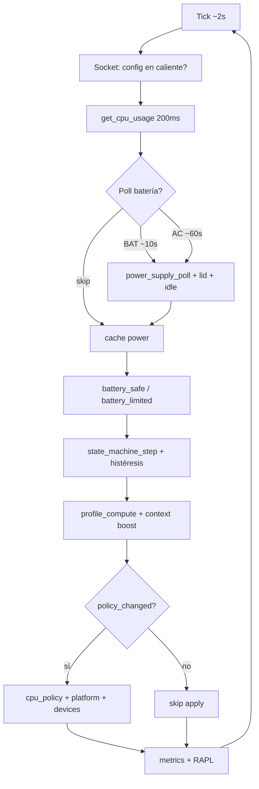

# Arquitectura

> **Última verificación:** 2026-07-08  
> **Fuente de verdad:** `core/loop.c`, `core/state_machine.c`, `power/profile.c`, `power/session_idle.c`, `power/lid_state.c`, `cpu/policy.c`, `Makefile`

## Resumen

powergov es un daemon en C que cada **~2 segundos** evalúa carga CPU y contexto de alimentación, calcula una **política efectiva** y aplica cambios en sysfs **solo cuando la política o la máscara de features cambia** (idempotente). Al recibir SIGTERM restaura freq cap, runtime PM y capas device PM tocadas.

No modifica el kernel: consume interfaces estándar de Linux (`cpufreq`, EPP, `powercap`, ACPI platform profile, runtime PM, logind).

## Árbol de módulos

```
include/powergov/types.h     Tipos, config, constantes
config/                      Carga/guardado /etc/powergov.conf
core/
  sysfs.c                    Lectura/escritura sysfs (buffers fijos)
  state_machine.c            POWERSAVE ↔ BALANCED ↔ PERFORMANCE
  loop.c                     Orquestación del daemon + socket
power/
  power_supply.c             AC/batería, SOC, lid, session_idle
  lid_state.c                Tapa abierta/cerrada (ACPI)
  session_idle.c             IdleHint vía logind
  profile.c                  Modo usuario + contexto → política efectiva
cpu/
  cpu_load.c                 Carga vía /proc/stat (ventana 200 ms)
  governor.c, epp.c, freq_cap.c, turbo.c
  policy.c                   Aplica subsistemas CPU habilitados
platform/platform_profile.c  /sys/firmware/acpi/platform_profile
devices/                     runtime_pm, peripheral_pm, disk_pm, pcie_aspm, bluetooth_pm
metrics/metrics.c            Contadores apply/verify + RAPL
log/log.c                    Log dev → /var/log/powergov/powergov.log
client/                      libpowergov.so (UI)
ui/                          GTK 3
main.c                       CLI
```

## Flujo por tick (determinista)



**Poll adaptativo:** en batería relee `power_supply` cada 5 ticks (~10 s); en AC cada 30 ticks (~60 s). Constantes `POWERGOV_BATTERY_REFRESH` / `POWERGOV_BATTERY_REFRESH_AC` en `types.h`.

## Máquina de estados (governor lógico)

Umbrales por defecto (`include/powergov/types.h`):

| Transición | Condición |
|------------|-----------|
| POWERSAVE → BALANCED | carga > 25% durante 3 ticks |
| BALANCED → PERFORMANCE | carga > 75%, AC o modo performance, no battery_limited |
| PERFORMANCE → BALANCED | carga < 60%, o battery_limited, o modo max-battery en batería |
| BALANCED → POWERSAVE | carga < 25% durante 3 ticks |

**Histéresis:** `POWERGOV_HYSTERESIS_SAMPLES` = 3 ticks consecutivos antes de subir/bajar de estado (evita thrashing).

**battery_limited:** activo si `BATTERY_SAFE_THRESHOLD` > 0 y SOC ≤ umbral; bloquea estado PERFORMANCE.

## Política efectiva (`power/profile.c`)

La máquina de estados elige el **estado lógico**; el perfil de usuario y la fuente de alimentación mapean a valores concretos. Tras el cálculo base, `apply_context_aggression_boost()` puede elevar `device_aggression` por tapa cerrada o sesión idle (v1.13).

| Campo | Ejemplo en batería + max-battery |
|-------|----------------------------------|
| governor | powersave / schedutil |
| epp | balance_power / power |
| turbo_on | 0 |
| freq_cap_pct | 80 (60 si SOC ≤ LOW_BATTERY) |
| platform_profile | low-power |
| runtime_pm_aggressive | 1 |
| device_aggression | 0–3 (reactivo + contexto) |
| allow_performance | 0 |

Modo `performance` del usuario fuerza `allow_performance = 1` incluso en batería.

## Conflictos con otros daemons

- Si existe **power-profiles-daemon** (ppd), `platform_profile` se deshabilita al arrancar (`platform_ppd_active()` en `platform/platform_profile.c`).
- **TLP** activo: powergov difiere runtime_pm, peripheral_pm, disk_pm, pcie_aspm, bluetooth_pm.
- cpupower u otros scripts que escriban los mismos nodos sysfs pueden competir; conviene un solo dueño de CPU.

## Restore al apagar

En `core/loop.c` al salir del loop:

1. `cpu_policy_restore()` — restaura `scaling_max_freq` guardado
2. `runtime_pm_restore()` y restores de device PM
3. Cierre de socket y pidfile

## Rendimiento del propio daemon

- Sin `malloc` en el hot path del loop principal
- Apply condicionado a `policy_changed()` + máscara de features
- Escritura sysfs skip si el valor ya coincide (`apply_skip` en métricas)
- Poll de batería/tapa/idle menos frecuente en AC
- `Nice=10` en `service/powergov.service` (baja prioridad CPU)
